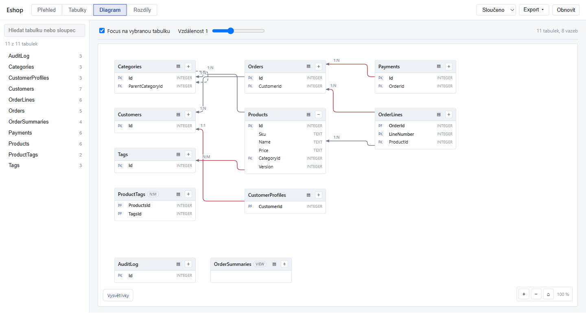
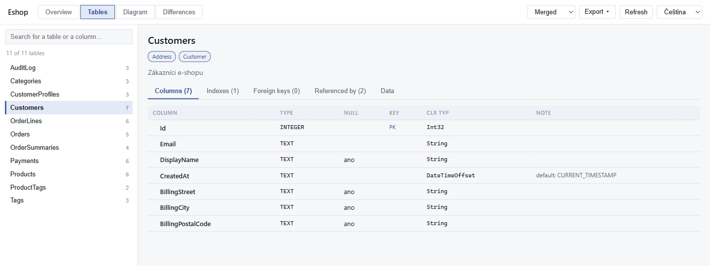
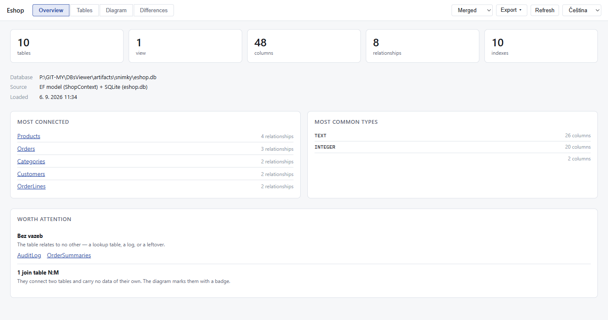
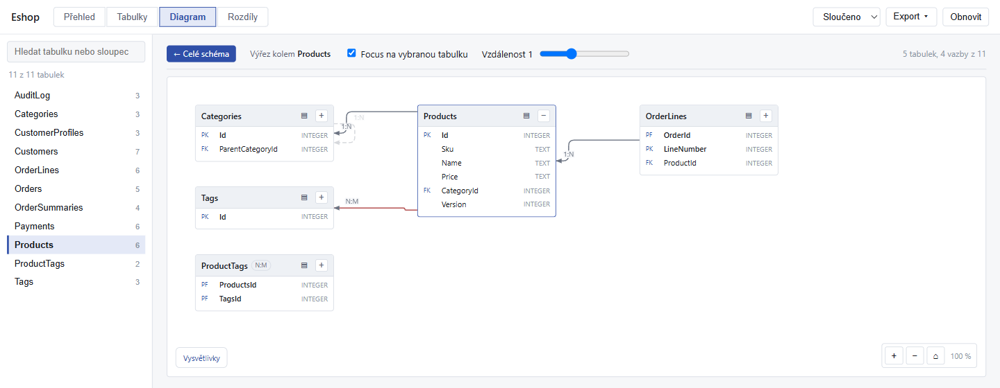
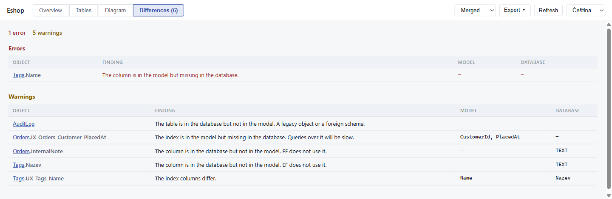
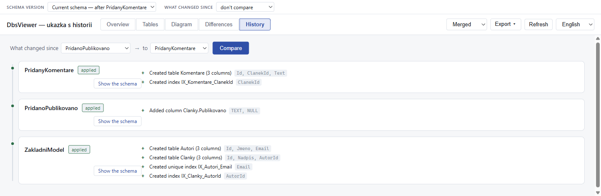
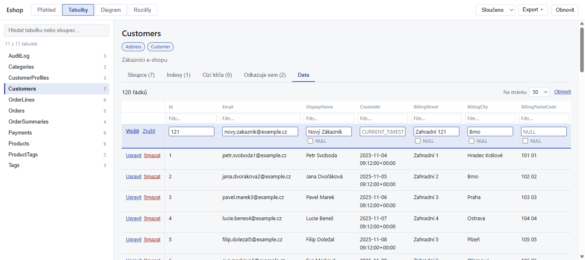
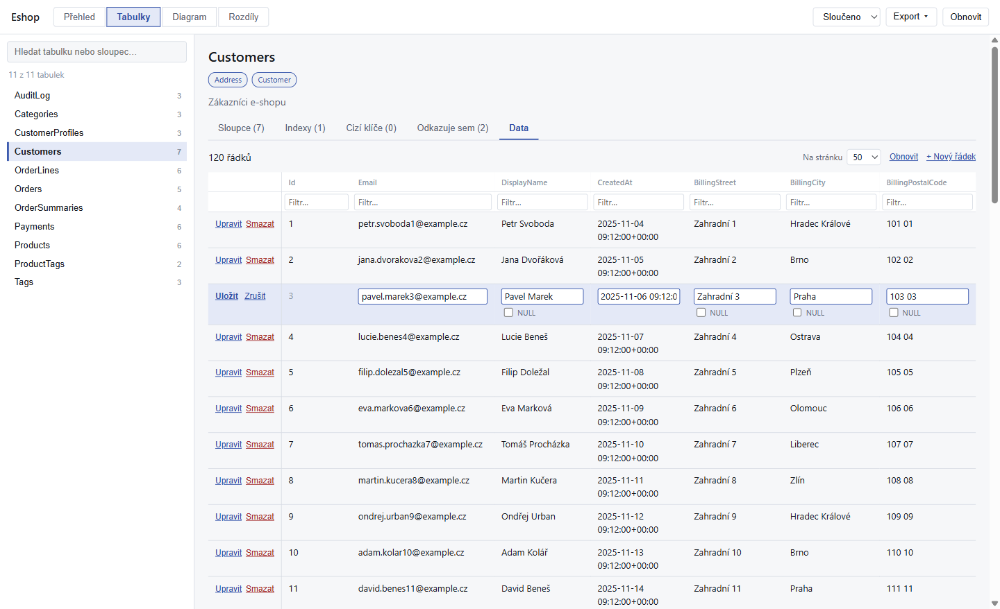
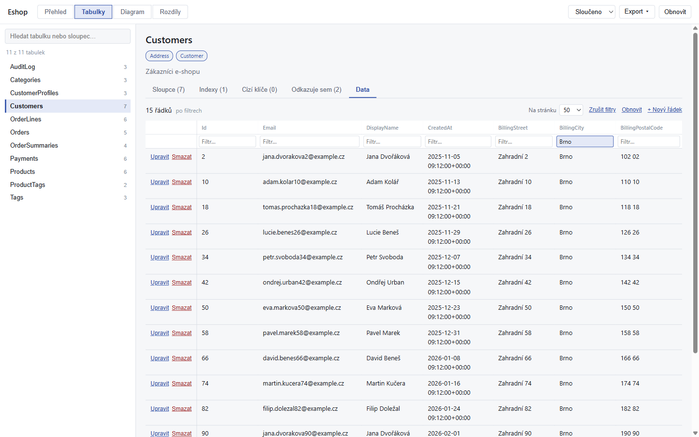

# DbsViewer

**English** · [Čeština](README.cs.md)

[](https://github.com/MichalZem/DBsViewer/actions/workflows/build-a-publikace.yml)

A database schema viewer you drop into any EF Core application. Two lines in `Program.cs`
give you an overview of tables, columns, indexes, keys and relationships — plus detection
of the differences between what EF believes and what the database actually contains.

```csharp
builder.Services.AddDbsViewer<AppDbContext>();   // 1
app.MapDbsViewer();                              // 2 → /dbschema
```

[](docs/obrazky/diagram.png)

*ER diagram of the sample model. The images below come from the running viewer, not from
a mockup — each one belongs to the [What you'll see](#what-youll-see) chapter.*

> **Note on language:** the project itself is Czech. The viewer's user interface, the
> command-line output, the diff messages and the architecture decision records are all
> written in Czech; this README is the English translation of [`README.cs.md`](README.cs.md).
> The API — option names, endpoints, JSON properties — is English.

> **Status:** released on nuget.org. The viewer has a graphical UI with an ER diagram,
> an HTTP API, drift detection, schema history and a data preview with optional row
> editing. The latest stable
> version is [`0.6.0`](https://www.nuget.org/packages/DbsViewer.Server); every push to
> `main` additionally produces a prerelease. See [installation](#installing-into-your-own-application).

---

## Installing into your own application

This chapter is written so that you can follow it without knowing the rest of the project.

### Prerequisites

| | |
|---|---|
| .NET SDK | 10.0 or newer |
| EF Core | 10.x |
| Database | Microsoft SQL Server or SQLite |
| Application type | anything on ASP.NET Core — Web API, MVC, Blazor Server, Blazor WASM host |

PostgreSQL and other databases are not supported.

### Step 1: install the package

```bash
dotnet add package DbsViewer.Server
```

That's all — the remaining packages (`DbsViewer.Abstractions`, `EfCore`, `Relational`,
`SqlServer`, `Sqlite`, `Analysis`) come along as dependencies. The Blazor UI is embedded
directly in `DbsViewer.Server`, so you don't need any other source of files.

If you want the latest development build, reach for a prerelease from `main`:

```bash
dotnet add package DbsViewer.Server --prerelease
```

Building from source is described in the [Development](#development) chapter — you don't
need it for ordinary use.

### Step 2: wire it into `Program.cs`

```csharp
using DbsViewer.Server;              // ← add this using

var builder = WebApplication.CreateBuilder(args);

builder.Services.AddDbContext<AppDbContext>(o => o.UseSqlite("Data Source=app.db"));
builder.Services.AddDbsViewer<AppDbContext>();     // ← line 1

var app = builder.Build();

app.MapDbsViewer();                                // ← line 2

app.Run();
```

The type parameter of `AddDbsViewer<T>` is your `DbContext`. There is nothing else to
configure — the component determines the provider (SQL Server or SQLite) on its own and
enables live introspection automatically.

**Call order:** `MapDbsViewer()` must be called after `app.Build()`. If the application
uses `UseAuthentication()` and `UseAuthorization()`, then `MapDbsViewer()` belongs after them.

### Step 3: verify

Run the application and open in a browser:

```
http://localhost:<port>/dbschema
```

You'll see the viewer: at the top a switch between the overview, the table list, the ER
diagram and the differences. In the list, search is on the left and the detail with its
tabs on the right.

If you only want to check the API:

```
http://localhost:<port>/dbschema/api/meta
```

The response looks like this:

```json
{
  "title": "Schéma databáze",
  "routePrefix": "/dbschema",
  "views": ["ef", "live", "merged"],
  "canDiff": true,
  "canPreviewData": false,
  "showRowCounts": false,
  "groups": {},
  "dataPreviewMaxRows": 100,
  "canBrowseHistory": false
}
```

If you get a `404`, the application probably isn't running in the development environment —
by default the viewer is available **only in Development**. See [Security](#security).

---

## What you'll see

**Table browser.** On the left a list with a search box that matches table names **and
column names** — a column is often the only thing a person knows. On the right the detail
with tabs *Sloupce (Columns), Indexy (Indexes), Cizí klíče (Foreign keys), Odkazuje sem
(Referenced by), Data*.

The **Odkazuje sem** (Referenced by) tab is the inverse view of foreign keys and answers
the question "what breaks if I change this table". Common tools don't have it, yet it is
the most useful thing when you touch a schema.

[](docs/obrazky/tabulky.png)

**Overview** is the entry screen into an unfamiliar database: how many tables, columns,
relationships and indexes there are, which tables are the largest and the most connected,
which types are used — and a *Co stojí za pozornost* (Worth attention) section listing
tables without a primary key, foreign keys without an index and tables that relate to
nothing. Every name is a link into the detail.

[](docs/obrazky/prehled.png)

**ER diagram.** Tables as nodes, relationships as edges labelled with cardinality. Cascades
get their own colour — that is what people look for most often in an unfamiliar schema.
Optional relationships are dashed, and an N:M relationship is a single edge instead of two
through the join table.

Edges are routed around tables, not across them: the route is searched on a grid at a
distance from the node borders and turns are penalised, so the result is the straightest
possible line that never disappears underneath a table. Relationships pointing into the
same table each get their own anchor so the arrowheads don't merge into one point.

The layout assumes what real schemas look like: shallow and wide. Parts of the schema
that share no relationship at all — authentication next to invoices — are laid out
separately and packed side by side; a layer taller than the whole canvas wraps into
sub-columns; tables without a single relationship go into a grid at the end, because in
a column they take up space and say nothing about the schema. Without that the number of
columns follows the depth of the foreign keys, and a database of thirty tables comes out
as a strip three columns wide and twenty rows tall. The dimensions are derived from the
area of the nodes, not from the window size, so the diagram always looks the same.
Expanding a node to all its columns does not move the layout — where a table belongs is
decided from the collapsed heights, so an expanded node only pushes its own column and
whatever sits below it. Details in
[ADR-0016](docs/adr/0016-rozvrzeni-velkeho-schematu.md) (in Czech).

The legend for the line types sits in the bottom-left corner of the diagram, collapsed
into a chip. What the whole diagram looks like is visible [in the image at the top](#dbsviewer).

**Focus mode** is on by default and it is the only way to make a diagram with a hundred
tables readable: pick a table and use the slider to say how far around it should be drawn.
Zero shows just that table, three already captures the wider neighbourhood. The
**← Celé schéma** (Whole schema) button leads back to the full picture — inside a cut-out
there is no way to tell from the diagram that the rest of the schema even exists.

Nodes can be expanded to all their columns, the canvas pans by dragging and zooms with
the wheel. With the data preview on, each node header also carries a **▤** symbol that jumps
straight to that table's data — from the diagram, "and what is in it" is the most common
next question.

[](docs/obrazky/diagram-focus.png)

**Differences.** The findings of comparing the model against the database, grouped by
severity. A table with a finding is highlighted in the list and in the diagram too, so it
is visible where the problem is.

[](docs/obrazky/rozdily.png)

*A missing column is an error, an extra table only a warning — a legacy object next to the
EF model is a normal state, not a fault.*

**History.** The *Historie* (History) tab shows a timeline of EF migrations and, for each
one, what it changed — added columns, indexes, tables, type changes. The **Zobrazit schéma**
(Show schema) button switches the viewer into the past: the overview, the table list and
the diagram then show the state after that migration. The bar at the top leads back.

[](docs/obrazky/historie.png)

Any two versions can be compared — they don't have to be adjacent. The result reads in the
direction of time: "a column was added", not "a column is missing from the model".

It is read from the snapshots EF stores with every migration; DbsViewer never writes
anything anywhere. It requires EF migrations whose code is present in the project — a
migration that ran but whose class is gone shows up only with the state *chybí v kódu*
(missing in code). Details and limits in
[ADR-0014](docs/adr/0014-historie-schematu-z-migraci.md) (Czech).

**Data.** The *Data* tab in the table detail loads by itself, without clicking. The grid
can page, sort by clicking the header (ascending → descending → unsorted) and filter with
the box under each column.

All of this is done by the **database**, not by the viewer: `LIMIT`/`OFFSET` respectively
`OFFSET`/`FETCH`, `ORDER BY` and a parameterised `WHERE`. No more than one page is ever
loaded into memory, so the grid works the same over ten rows as over millions. The total
count is computed with `COUNT(*)`; when that query doesn't finish within the timeout,
paging continues, just without page numbers.

The filter looks for text anywhere in the value, including over numbers and dates. The
wildcards `%` and `_` are escaped — someone searching for "100%" really is searching for
"100%".

**Editing rows.** When `DataPreview.AllowUpdate` or `AllowDelete` is on, every row gets
buttons *Upravit* (edit) and *Smazat* (delete). Editing switches the row into input boxes;
a nullable column also offers a `NULL` checkbox. Only the columns you actually changed are
sent. Deleting asks for confirmation right in the row — the viewer never opens a browser
dialog.

A row is always addressed by its **complete primary key**, and the write must touch exactly
one row. A table without a primary key, a view, and a table whose key is masked stay
read-only, and the grid says so instead of offering buttons that would fail. The same holds
for individual columns: the primary key, columns generated by the database, computed
columns, binary columns and masked columns cannot be changed, and hovering the cell explains
why. What the database refuses (a foreign key, `NOT NULL`, a check constraint) shows up as
its own message above the grid, and the edited values stay where they are.

**A new row.** With `DataPreview.AllowInsert` on, a *+ Nový řádek* (new row) button sits above
the grid and opens an empty row above the data. A field you leave empty never reaches the `INSERT`
at all, so the database default applies — and to make that visible, the field shows it as a
placeholder (`NULL` for a column that may be empty). Unlike editing, the primary key **may**
be filled in for a new row; otherwise nothing could be inserted into a table with a natural
key. Columns generated by the database, computed, binary and masked ones are not filled in.
Inserting works even in a table without a primary key — an `INSERT` addresses no existing row.
The reasoning is in [ADR-0017](docs/adr/0017-vkladani-radku.md) (Czech).

[](docs/obrazky/data-novy-radek.png)

*A row being created: `CreatedAt` shows the database default (`CURRENT_TIMESTAMP`) as its
placeholder, `BillingPostalCode` shows `NULL`. Whatever stays empty never reaches the
`INSERT` at all.*

[](docs/obrazky/data-editace.png)

*A row being edited: `Id` stayed plain text, because that is what addresses the row, and
columns that may be empty got a `NULL` checkbox.*

[](docs/obrazky/data.png)

*The `Brno` filter over the `BillingCity` column: 15 rows left out of 120, and the count
was recomputed by the database, not by the viewer.*

**Export.** The schema can be downloaded as Mermaid, DBML or Markdown documentation — as
a file you can commit into the repository.

---

## HTTP API

The UI calls everything through this API, so it can be used on its own as well.
All paths are relative to `RoutePrefix` (`/dbschema` by default).

| Method | Path | Returns |
|---|---|---|
| `GET` | `/` | The graphical viewer (Blazor WebAssembly). |
| `GET` | `/api/meta` | What is available in this configuration. Call it first. |
| `GET` | `/api/schema` | The whole schema. `source=ef\|live\|merged`, `migration={id}` for a historical version, `refresh=true` bypasses the cache. |
| `GET` | `/api/schema/diff` | Differences between the EF model and the database. |
| `GET` | `/api/tables/{schema}/{name}` | Detail of a single table. |
| `POST` | `/api/tables/{schema}/{name}/rows` | A page of data. Returns `403` by default. |
| `POST` | `/api/tables/{schema}/{name}/rows/update` | New values for one row. Returns `403` by default. |
| `POST` | `/api/tables/{schema}/{name}/rows/insert` | Inserts one row. Returns `403` by default. |
| `POST` | `/api/tables/{schema}/{name}/rows/delete` | Deletes one row. Returns `403` by default. |
| `GET` | `/api/migrations` | Migrations together with what each of them changed. |
| `GET` | `/api/migrations/diff?from=&to=` | Difference between two versions of the history. |
| `POST` | `/api/refresh` | Drops the cache. |

**An empty schema is written as a dash in the path.** SQLite has no schemas, so a table
detail is `/api/tables/-/Customers`. On SQL Server it is `/api/tables/dbo/Customers`.

**Data goes over POST, not GET.** The searched value is database content and in the URL it
would end up in the browser history and in the server log. The request body:

```json
{
  "page": 0,
  "pageSize": 50,
  "sortColumn": "CreatedAt",
  "sortDescending": true,
  "filters": [
    { "column": "Email", "operator": "Contains", "value": "@firma.cz" }
  ]
}
```

Operators: `Contains`, `Equals`, `StartsWith`, `EndsWith`, `GreaterThan`, `LessThan`,
`IsNull`, `IsNotNull`. The response carries `rows`, `totalRows`, `pageCount` and `hasMore`.

**Writes carry the whole primary key.** `key` addresses the row, `values` says what changes;
`null` means SQL NULL. Only the listed columns are touched.

```json
{
  "key": [ { "column": "Id", "value": "42" } ],
  "values": [
    { "column": "DisplayName", "value": "Jan Novák" },
    { "column": "Note", "value": null }
  ]
}
```

Deleting takes the same body without `values`. Both answer `{ "affected": 1 }`. A rejected
request answers `400` with a Czech message in `chyba` (a value that doesn't fit the column,
a column that cannot be changed, a row that is no longer there, or the database's own
error); an operation that isn't allowed at all answers `403`.

### Views of the schema

| `source` | What it returns |
|---|---|
| `ef` | The EF model only. Knows navigations, CLR types, comments, inheritance. Doesn't touch the database. |
| `live` | Only what is really in the database. Knows the actual indexes, defaults, computed columns, row counts. |
| `merged` | Both merged together. **The default** when both sources are available. |

The merging rule: *the database is right about what is in it; the model is right about
the intent.* In detail in [ADR-0009](docs/adr/0009-databaze-ma-pravdu-o-sobe.md) (Czech).

### Shape of the `/api/schema` response

```json
{
  "databaseName": "app.db",
  "provider": "Sqlite",
  "sourceKind": "Merged",
  "generatedAtUtc": "2026-08-27T18:42:11+00:00",
  "tables": [
    {
      "name": { "name": "Posts" },
      "columns": [
        {
          "name": "Id",
          "ordinal": 1,
          "storeType": "INTEGER",
          "clrType": "System.Int32",
          "isNullable": false,
          "isPrimaryKey": true,
          "isIdentity": true,
          "propertyNames": ["Id"]
        },
        {
          "name": "BlogId",
          "ordinal": 3,
          "storeType": "INTEGER",
          "clrType": "System.Int32",
          "isNullable": false,
          "isForeignKey": true,
          "propertyNames": ["BlogId"]
        }
      ],
      "primaryKey": { "name": "PK_Posts", "columns": ["Id"] },
      "indexes": [{ "name": "IX_Posts_BlogId", "columns": ["BlogId"], "isUnique": false }],
      "foreignKeys": [
        {
          "name": "FK_Posts_Blogs",
          "columns": ["BlogId"],
          "principalTable": { "name": "Blogs" },
          "principalColumns": ["Id"],
          "deleteBehavior": "Cascade",
          "navigationName": "Blog",
          "inverseNavigationName": "Posts"
        }
      ]
    }
  ],
  "relationships": [
    {
      "id": "fk:Posts|FK_Posts_Blogs",
      "from": { "name": "Posts" },
      "to": { "name": "Blogs" },
      "cardinality": "OneToMany",
      "isRequired": true,
      "isIdentifying": false,
      "fromColumns": ["BlogId"],
      "toColumns": ["Id"],
      "fromNavigation": "Blog"
    }
  ],
  "migrations": [],
  "warnings": []
}
```

Key properties of the shape:

- **`relationships` is not the same thing as `foreignKeys`.** They are derived for drawing:
  an N:M relationship through a join table is a single edge with `cardinality: "ManyToMany"`
  and a filled-in `viaJoinTable`, not two foreign keys. In detail in
  [ADR-0007](docs/adr/0007-vztahy-ne-cizi-klice.md) (Czech).
- **`cardinality`** takes the values `OneToOne`, `OneToMany`, `ManyToMany`.
- **`isIdentifying`** means the foreign key is part of the primary key.
- **`warnings`** contains the texts of whatever could not be read. Reading the schema never
  fails — a partial failure ends up here.
- Enums are serialised **as text**, not as a number. Properties are in `camelCase`.
- Empty and `null` values are omitted from the response.

### Shape of the `/api/schema/diff` response

```json
{
  "findings": [
    {
      "kind": "IndexMissingInModel",
      "severity": "Warning",
      "table": { "name": "Customers" },
      "object": "IX_Rucne_Pridany",
      "message": "Index je v databázi, ale v modelu není. Ručně doladěný výkon mimo migrace.",
      "databaseValue": "DisplayName"
    }
  ],
  "comparedAtUtc": "2026-08-27T18:42:11+00:00",
  "isClean": false,
  "errorCount": 0,
  "warningCount": 1
}
```

Findings are ordered from the most severe. `severity` is `Error`, `Warning` or `Info`.
The kinds of findings (`kind`) cover missing tables and columns on both sides, mismatches
of types, nullability, lengths, defaults, keys, indexes, foreign keys and migration state.
The `message` is in Czech, like the rest of the user-facing text.

---

## Configuration

Everything is optional. Without configuration, safe defaults apply.

```csharp
builder.Services.AddDbsViewer<AppDbContext>(options =>
{
    // Where the viewer runs
    options.RoutePrefix = "/_db";                  // default "/dbschema"
    options.Title = "Eshop — schéma";

    // Where it is available
    options.EnabledIn = HostEnv.Development | HostEnv.Staging;   // default: Development only
    options.RequireAuthorization("DbSchemaAdmins");              // mandatory outside Development

    // What gets read
    options.IncludeLiveDatabase = true;            // default true
    options.ShowRowCounts = true;                  // default false
    options.CacheFor = TimeSpan.FromMinutes(10);   // default 5 minutes, Zero disables the cache

    // What gets displayed
    options.HideTables.Add("__EFMigrationsHistory");
    options.HideTables.Add("AspNetUser*");         // supports *
    options.IncludeSchemas.Add("dbo");             // empty = all schemas
    options.Groups["Sklad"] = "Warehouse*";        // groups for the filter in the UI

    // Data preview — see Security
    options.DataPreview.Enabled = true;            // default false
    options.DataPreview.MaxRows = 50;              // page size cap; default 100, hard cap 1000
    options.DataPreview.CommandTimeoutSeconds = 15; // default 30; protects mainly COUNT(*)
    options.DataPreview.MaskColumns.Add("Email");  // default *Password*, *Secret*, *Token*
    options.DataPreview.AllowedTables.Add("Order*");

    // Editing rows — see Security
    options.DataPreview.AllowUpdate = true;        // default false
    options.DataPreview.AllowDelete = true;        // default false
    options.DataPreview.AllowInsert = true;        // default false
    options.DataPreview.EditableTables.Add("Order*"); // empty = everything the preview allows
});
```

### Without a `DbContext`

For a foreign or legacy database you have no EF model for:

```csharp
using DbsViewer.SqlServer;

builder.Services.AddDbsViewer(
    _ => new SqlServerSchemaSource("Server=.;Database=Legacy;Trusted_Connection=True;TrustServerCertificate=True"),
    options => options.Title = "Legacy databáze");
```

There is neither a diff nor a merged view in this mode — the model to compare against is
missing. `/api/meta` reports that in the `views` field.

---

## Security

A database schema is sensitive information. The defaults are therefore restrictive and
some rules **cannot be worked around by configuration**. The reasoning is in
[ADR-0006](docs/adr/0006-bezpecnostni-defaulty.md) (Czech).

| Rule | Behaviour |
|---|---|
| Availability | Only in `Development`. Anywhere else an explicit `EnabledIn` is required. |
| Authorization | Outside Development a policy is **mandatory**. Without one the application **won't start** — `MapDbsViewer()` throws. |
| Schema changes | No endpoint runs DDL. That is a property of the API, not a switch. |
| Editing data | Off, and on top of the data preview. It changes values in one row addressed by its complete primary key, or deletes that row — nothing else. No inserts, no bulk operations. |
| Data preview | Off. Turning it on is a separate decision, independent of exposing the schema. |
| Data preview in production | The application won't start until you set `DataPreview.AllowInProduction = true`. |
| User SQL | Never accepted. A table name is validated against the loaded schema and only then escaped. |
| Audit | Every data preview and every write is logged at the `Information` level — who, which table, and for a write which columns. Values are never logged. |

Failing at startup is intentional. A warning in the log would not be read in time; the
exception happens in the deployment pipeline, not in production.

Recommended operation: fully enabled in Development, schema and diff behind authorization
in Staging, in production either not at all or only the schema for a narrow role, and the
data preview — let alone editing — never. Keep the data preview settings in environment
configuration, not in code, so that it cannot be turned on by accident during a deployment.

---

## Troubleshooting

| Symptom | Cause and remedy |
|---|---|
| `404` on `/dbschema/api/meta` | The application isn't running in `Development`. Set `EnabledIn` and an authorization policy, or run with `ASPNETCORE_ENVIRONMENT=Development`. |
| Exception at startup, "autorizační policy" | The viewer is enabled outside Development without a policy. Call `RequireAuthorization("…")`, or restrict `EnabledIn` to `HostEnv.Development`. |
| Exception at startup, "náhled dat" | The data preview in production. Either turn it off or set `DataPreview.AllowInProduction = true`. |
| "není zaregistrovaná čtečka živé databáze" | The provider is neither SQL Server nor SQLite. Set `IncludeLiveDatabase = false`. |
| `views` contains only `["ef"]` | Live introspection didn't turn on. Check `IncludeLiveDatabase` and the provider. |
| `403` on `/rows` | The data preview is off, or the table isn't on the whitelist. |
| `403` on `/rows/update` | Writing is off (`AllowUpdate`, `AllowDelete`, `AllowInsert`), or the table isn't in `EditableTables`. |
| The grid offers no edit buttons | The table has no primary key, it is a view, or its key is masked — the note above the grid says which. |
| Database changes don't show up | The cache. Call `POST /api/refresh`, add `?refresh=true`, or lower `CacheFor`. |
| The package wasn't found | Prereleases aren't offered without `--prerelease`. When building from source, check the path in `NuGet.config` and that `artifacts/packages` really does contain `.nupkg` files; after repacking the same version, clear the cache: `dotnet nuget locals global-packages --clear`. |

---

## Without an application: the command-line tool

The schema can also be dumped without wiring anything into an application. The tool
installs as a `dotnet tool`:

```bash
dotnet tool install -g DbsViewer.Tool
```

Then:

```bash
# the sample model from the repository
dbsview

# a live database
dbsview --sqlite ./app.db --rows
dbsview --sqlserver "Server=.;Database=Eshop;Trusted_Connection=True"

# drift between the EF model and the database
dbsview --diff ./app.db

# schema documentation into the repository
dbsview --sqlite ./app.db --export docs/schema.md --format markdown
dbsview --sqlite ./app.db --export docs/schema.mmd --format mermaid

# JSON to disk
dbsview --json schema.json

# help
dbsview --help
```

Without installing, it can also be run straight from source:

```bash
dotnet run --project tools/DbsViewer.Dump -- --help
```

The output (the tool speaks Czech, like the rest of the project):

```
Databáze  : main
Provider  : Sqlite (Microsoft.EntityFrameworkCore.Sqlite)
Zdroj     : EF model (ShopContext) [EfModel]
Tabulek   : 10, vztahů: 8

■ OrderLines   [OrderLine]
  PK FK OrderId                  INTEGER            NOT NULL
  PK    LineNumber               INTEGER            NOT NULL
     FK ProductId                INTEGER            NOT NULL
        Total                    TEXT               NOT NULL  computed: "Quantity" * "UnitPrice"
    ⌗ IX_OrderLines_ProductId (ProductId)

■ Payments   [BankTransfer+CardPayment+Payment · TPH:PaymentType]
  PK    Id                       INTEGER            NOT NULL  identity

── Vztahy ──
  1:N  Categories ← Categories  onDelete=Restrict [self]
  1:1  Customers ← CustomerProfiles  onDelete=Cascade [identifying]
  N:M  Tags ← Products via ProductTags  onDelete=Cascade
```

The `--diff` mode returns **exit code 2** when it finds an error, so it can be used as a
check in CI:

```yaml
- name: Kontrola driftu databáze
  run: dbsview --diff "${{ secrets.CONNECTION_STRING }}"
```

A sample of the generated documentation is in [`docs/schema-ukazka.md`](docs/schema-ukazka.md).

---

## What the component can do

- **Tables and views** including comments, computed columns, defaults, collation, check constraints
- **Relationships, not foreign keys** — 1:1, 1:N and N:M with the join table collapsed,
  identifying relationships, self-references
- **The whole EF model** — TPH inheritance, owned types, shadow properties, custom schemas
- **Drift detection** — an unapplied migration, a manually added index, an extra column,
  a `DeleteBehavior` that behaves differently from what the model claims
- **Resilience** — reading the schema never fails, a partial failure ends up in `warnings`
- **A graphical UI** — database overview, table browser, ER diagram with focus mode,
  overview of differences, schema history by migration, a paged data grid with optional
  editing and deleting of rows, export to Mermaid, DBML and Markdown

Data sources:

| Source | Knows in addition |
|---|---|
| **EF Core model** | navigations, N:M through skip navigations, CLR types, `DeleteBehavior`, owned types, TPH |
| **Live database** | the real indexes including `INCLUDE` and filtered ones, computed columns, defaults, an estimate of the row count |

---

## Development

```bash
# In Debug a plain build is enough. Release needs the UI published first,
# because the server package embeds it into the assembly.
dotnet build

cd tests/DbsViewer.EfCore.Tests && dotnet test
cd tests/DbsViewer.Relational.Tests && dotnet test
cd tests/DbsViewer.Server.Tests && dotnet test
cd tests/DbsViewer.Ui.Tests && dotnet test
cd tests/DbsViewer.Tool.Tests && dotnet test
```

The Blazor UI is embedded into the server package only in `Release` — in `Debug` publishing
the UI would slow down every build. It can be forced with `-p:EmbedDbsViewerUi=true`, but
then the UI must be published into `artifacts/ui`:

```bash
dotnet publish src/DbsViewer.Ui -c Release -o artifacts/ui
dotnet build -c Release
```

Publishing is a separate command on purpose. As long as an MSBuild target handled it,
`DbsViewer.Ui` was being built concurrently with the solution building it (it is in the
solution because of the tests), and the build kept failing on locked intermediate files —
reliably on CI, only occasionally on a slower machine. When the published UI is missing,
the build says so right away; a package without the UI can never come into existence.

Packages from source — for trying out a change in another application before it reaches
nuget.org:

```bash
dotnet publish src/DbsViewer.Ui -c Release -o artifacts/ui

for p in Abstractions EfCore Relational SqlServer Sqlite Analysis Server; do
  dotnet pack src/DbsViewer.$p -c Release -o artifacts/packages
done
dotnet pack tools/DbsViewer.Dump -c Release -o artifacts/packages
```

The target application then needs `artifacts/packages` as a package source — either
`dotnet add package DbsViewer.Server --source <path>`, or a `NuGet.config` next to its
`.csproj`:

```xml
<?xml version="1.0" encoding="utf-8"?>
<configuration>
  <packageSources>
    <clear />
    <add key="dbsviewer-local" value="C:\path\to\DBsViewer\artifacts\packages" />
    <add key="nuget.org" value="https://api.nuget.org/v3/index.json" />
  </packageSources>
</configuration>
```

The tests enforce **100% line and method coverage** — the build fails when coverage drops.
The reasoning is in [ADR-0005](docs/adr/0005-stoprocentni-pokryti.md) (Czech). The report
ends up in `artifacts/coverage/`.

Architecture decisions and their reasons are in [`docs/adr/`](docs/adr/README.md) (Czech).
The rules for working on the project are in [`CLAUDE.md`](CLAUDE.md) (Czech).

### Structure

| Project | Purpose |
|---|---|
| `src/DbsViewer.Abstractions` | Data model, contracts, derivation functions. No dependencies. |
| `src/DbsViewer.EfCore` | Reading the schema from the EF model |
| `src/DbsViewer.Relational` | Shared layer of live introspection |
| `src/DbsViewer.SqlServer` | SQL Server introspection over `sys.*` |
| `src/DbsViewer.Sqlite` | SQLite introspection over `PRAGMA` |
| `src/DbsViewer.Analysis` | Merging and comparing schemas |
| `src/DbsViewer.Server` | `AddDbsViewer`, `MapDbsViewer`, HTTP API, hosting of the UI — **this is what you install** |
| `src/DbsViewer.Ui` | The Blazor WASM viewer, embedded into the server package |
| `samples/DbsViewer.SampleShop` | Sample model for the tests |
| `samples/DbsViewer.SampleMigrations` | Model with real EF migrations — for the schema history |
| `tools/DbsViewer.Dump` | `dotnet tool dbsview` — schema dump, diff and export |
| `tests/*` | Tests with enforced coverage |

### Stages

| # | Stage | Status |
|---|---|---|
| 01 | Data model, reading from the EF model | ✅ done |
| 02 | Live introspection, merging, diff engine | ✅ done |
| 03 | `AddDbsViewer` / `MapDbsViewer`, HTTP API, authorization, data preview | ✅ done |
| 04 | Blazor WASM UI, embedding into the package | ✅ done |
| 05 | ER diagram, focus mode, export | ✅ done |
| 06 | Diff and data preview in the UI | ✅ done |
| 07 | `dotnet tool`, static snapshot | ✅ done |
| — | Publishing to nuget.org | ✅ done |

## Releasing

Publishing to NuGet is handled by [GitHub Actions](.github/workflows/build-a-publikace.yml).

| What you do | What happens |
|---|---|
| Push to `main` | Compilation, tests and the release of a **prerelease** version, for example `0.2.1-alpha.0.7` |
| `git tag v1.2.3 && git push origin v1.2.3` | The same plus the release of the **stable** version `1.2.3` and a GitHub release |
| Pull request | Only compilation and tests, nothing gets published |

The version is determined by the **last git tag**, not by a number in a file — that is
handled by [MinVer](https://github.com/adamralph/minver). After the tag `v1.2.3`, every
further commit gets the version `1.2.4-alpha.0.N`, so two builds never fight over the
same number.

### What needs to be set up

Publishing goes through **Trusted Publishing**, so no NuGet key is stored in the
repository. The run asks GitHub for a signed OIDC token and exchanges it on nuget.org for
a temporary key valid for an hour.

**1. A policy on nuget.org** — sign in, click your name → *Trusted Publishing* and add a
policy:

| Field | Value |
|---|---|
| Repository Owner | `MichalZem` |
| Repository | `DBsViewer` |
| Workflow File | `build-a-publikace.yml` |
| Environment | leave empty |

**2. A variable in the repository** — *Settings → Secrets and variables → Actions → Variables*:

| Variable | What for | Required |
|---|---|---|
| `NUGET_USER` | The user name on nuget.org (**not the e-mail**) | Yes, otherwise publishing is skipped |

Alternatively from the command line: `gh variable set NUGET_USER --body "<name>"`.

Optionally also the secret `TEST_SQL_PASSWORD` (the password of the test SQL Server in the
container) — without it a default value is used.

Without `NUGET_USER` the workflow **doesn't fail** — it merely skips publishing and leaves
the packages in the run's artifacts, from where they can be downloaded manually. It behaves
the same way in a fork, which cannot reach the policy.

### Why SQL Server runs on CI

The integration tests need a real database: row mapping is tested with an in-memory reader,
but running queries over `sys.*` cannot be verified any other way. Without them the
coverage of `DbsViewer.SqlServer` drops below the threshold and the build rightly fails.
The workflow therefore runs SQL Server in a container; locally any instance will do and
the connection can be redirected with the `DBSVIEWER_TEST_SQLSERVER` variable.

## License

MIT
